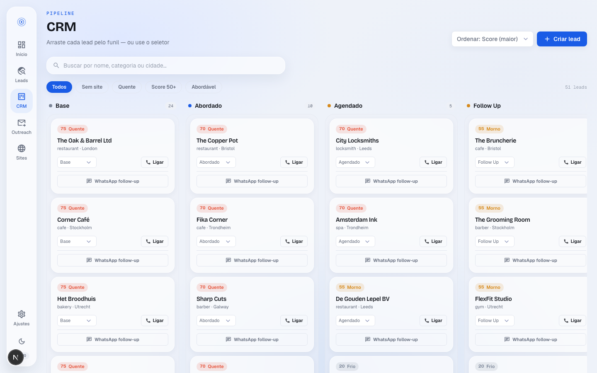
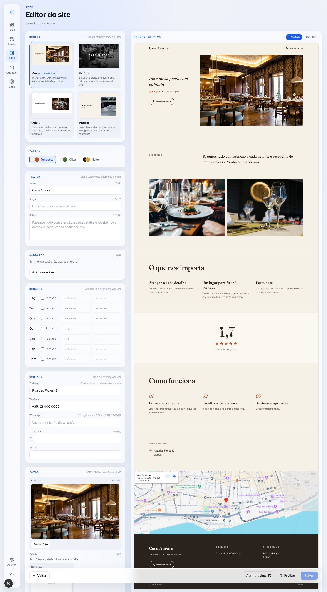

# Osprano

**Ache a dor. Aborde. Feche o site.**




Osprano encontra **negócios locais europeus com presença digital fraca**, pontua a "dor"
de cada um, e a **IA escreve a abordagem por email** — _compliant by design_. Você gera
um preview de site em segundos, fecha o cliente e transforma a venda única em **receita
recorrente** com hospedagem white-label na sua marca.

> Mercados de lançamento (opt-out, onde cold email é legal): 🇬🇧 Reino Unido · 🇳🇱 Holanda ·
> 🇮🇪 Irlanda · 🇸🇪 Suécia · 🇳🇴 Noruega. **Nada de WhatsApp a frio** (ilegal na UE).

---

## ✨ O que ela faz

- **Descoberta de leads** — busca por país, cidade e categoria em duas fontes: Google Places
  ou OpenStreetMap (grátis, sem chave), 1–50 por vez.
- **Digital Presence Score (0–100)** — pontua a dor por sinais reais: sem site, só rede
  social, sem HTTPS, não-mobile, lento, perfil incompleto. Maior score = lead mais quente.
- **Guardrail de compliance** — só libera abordagem onde é legal (mercado opt-out) e para
  entidades incorporadas / caixas de função ("a armadilha do autônomo").
- **CRM Kanban**: arraste os cards pelo funil (Base → Abordado → Agendado → Follow Up →
  Convertido → Perdido), com busca, filtros e detalhe do lead em abas. Cada lead tem uma
  **próxima ação** e a faixa **Hoje** lista as atrasadas e as do dia (Feito / Adiar); lead
  parado há 7+ dias fica marcado; **Perdido** exige motivo; o detalhe guarda contato, valores
  do negócio (setup + mensal, na moeda do país) e um **Histórico** com notas e eventos.
- **Outreach por IA** — email personalizado citando a dor + link do preview rastreado, com
  **caixa de saída** que acompanha o status (rascunho → enviado → abriu → respondeu).
- **Modelos de site**: 4 modelos por segmento (Mesa, Estúdio, Ofício, Vitrine), 3 paletas
  cada, com fotos e textos padrão em 10 idiomas; o preview rastreado `/p/<token>` e o site
  publicado `/site/<slug>` renderizam o mesmo modelo com o mesmo conteúdo salvo. **Editor de
  site** (`/crm/<leadId>/site`): escolhe modelo, paleta, textos, itens com preço, horário e
  contato (telefone, WhatsApp, Instagram, e-mail), sobe fotos com redimensionamento no
  navegador, acompanha a prévia ao vivo (desktop/celular) e publica white-label com URL
  própria; salvar depois de publicado atualiza o site no ar na hora. Nada de fato inventado
  sobre o negócio: texto padrão nunca afirma horário, preço ou histórico específico; seção com
  dado só aparece quando ela preenche.
- **Tema claro/escuro** em "vidro sobre névoa": cards translúcidos com blur sobre um fundo
  azul-acinzentado (névoa azul-marinho no escuro) e rail de 72px com ícone e nome. A paleta
  continua a "Product UI Styleguide" (azul vívido + cinzas neutros); a landing fica fora.



---

## 🧱 Stack

| Camada | Tecnologia |
|---|---|
| Frontend | **Next.js 16** (App Router, TypeScript strict, Turbopack) |
| Estilo | **Tailwind CSS v4** + design tokens (light/dark) · fontes Bricolage Grotesque + Geist |
| Ícones | Material Icons (`react-icons/md`) |
| Backend / DB | **Convex** (reativo, queries/mutations/actions + jobs agendados) |
| Auth | **Clerk** |
| Email | **Resend** (opcional) |
| Billing | **Stripe** (checkout + portal, opcional) |
| Dados | Google Places (Text Search, New) · OpenStreetMap/Overpass (fonte grátis, sem chave) · PageSpeed · Foursquare (secundário) |
| IA | **Anthropic** (Claude) para redigir a abordagem |

---

## 🚀 Como rodar

Pré-requisitos: **Node 20+**, **pnpm**, e contas em Convex + Clerk (ou use o **modo demo** abaixo).

```bash
pnpm install

# 1) Convex — cria o deployment e escreve NEXT_PUBLIC_CONVEX_URL no .env.local
npx convex dev

# 2) Variáveis de ambiente
cp .env.example .env.local   # preencha as chaves do Clerk (client) — veja abaixo

# 3) App
pnpm dev                     # http://localhost:3000
```

### Variáveis de ambiente

- **`.env.local`** (client): `NEXT_PUBLIC_CONVEX_URL` (o Convex escreve) e as chaves do
  **Clerk** (`NEXT_PUBLIC_CLERK_PUBLISHABLE_KEY`, `CLERK_SECRET_KEY`, URLs de sign-in/up).
- **Chaves de servidor** vão **dentro do deployment Convex** (não no `.env.local`):

  ```bash
  npx convex env set GOOGLE_PLACES_API_KEY <key>     # descoberta de leads
  npx convex env set ANTHROPIC_API_KEY <key>         # abordagem por IA
  npx convex env set APP_URL http://localhost:3000   # link dos previews
  npx convex env set CONVEX_ENV development          # obrigatório no deployment local (ver abaixo)
  npx convex env set CLERK_JWT_ISSUER_DOMAIN https://<seu-app>.clerk.accounts.dev
  # opcionais: RESEND_API_KEY / RESEND_FROM, STRIPE_*, FSQ_API_KEY, GOOGLE_PAGESPEED_API_KEY
  ```

  `CONVEX_ENV=development` libera o `localhost` no link da prévia. Sem ela o deployment é
  tratado como produção (default-deny, `convex/lib/env.ts`) e a abordagem por IA recusa
  `APP_URL` local — é o mesmo gate que impede link quebrado de chegar ao prospect.

  Veja o cabeçalho do [`.env.example`](./.env.example) para a lista completa.

### 🧪 Modo demo (sem Clerk, com dados de exemplo)

O jeito mais rápido de ver a aplicação **preenchida**, sem configurar auth nem APIs pagas:

```bash
# no deployment Convex
npx convex env set DEMO_MODE 1
npx convex env set CONVEX_ENV development   # obrigatório: o demo é default-deny (só liga fora de produção)
npx convex run demo:seed          # 48 negócios europeus + previews + caixa de saída

# no .env.local
NEXT_PUBLIC_DEMO=1

pnpm dev
```

No modo demo a auth é ignorada (org "demo") e a descoberta real (Places) fica desativada —
tudo roda em cima do seed.

> **Segurança:** o modo demo é inerte em produção — em qualquer deployment sem
> `CONVEX_ENV=development` a auth permanece ativa (segurança por padrão, mesmo com
> `DEMO_MODE=1` setado por engano). No Next, `NEXT_PUBLIC_DEMO=1` só tem efeito com
> `NODE_ENV` de desenvolvimento.

---

## 📜 Scripts

```bash
pnpm dev         # servidor de desenvolvimento
pnpm build       # build de produção
pnpm start       # servir o build
pnpm typecheck   # tsc --noEmit
pnpm lint        # eslint
pnpm test        # testes de unidade do domínio (node --test, 283 testes)
```

> Se `pnpm <script>` abortar com `ERR_PNPM_ABORTED_REMOVE_MODULES_DIR_NO_TTY` (o pnpm 11
> quer purgar o `node_modules` e não tem TTY pra perguntar), chame a ferramenta direto:
> `./node_modules/.bin/tsc --noEmit`, `./node_modules/.bin/eslint`,
> `node --experimental-strip-types --test tests/*.test.ts`. Ou rode `pnpm install` num
> terminal com TTY pra ressincronizar e o wrapper volta a funcionar.

---

## 🗂️ Estrutura

```
convex/              # schema, queries/mutations/actions, jobs, lógica de domínio (lib/)
src/app/             # rotas (App Router): landing, (app)/dashboard|leads|crm|outreach|sites|settings
src/app/(app)/crm/[leadId]/site/  # editor de site (página cheia, dentro do rail)
src/components/      # UI: rail (sidebar), cards, landing, gráficos, tema, event-glyph (ícone por evento)
src/components/crm/  # CRM: create-lead-modal, lead-detail, today-strip, next-action-form,
                     #      next-action-line, lead-info-fields, lost-reason-modal, lead-timeline
src/components/site-templates/  # 4 modelos (mesa, estudio, oficio, vitrine), paletas, TemplateThumb
src/components/site-editor/     # blocos do editor: modelo, textos, itens, horário, contato, fotos, prévia ao vivo
src/lib/             # helpers (playbook de vendas, providers, use-now: relógio em estado)
public/templates/    # fotos padrão dos 4 modelos + LICENSES.md
tests/               # testes de unidade do domínio (283)
docs/redesign/       # screenshots finais da área logada (1440px, claro e escuro)
docs/superpowers/    # specs e planos do redesenho, do CRM e dos modelos de site (workflow superpowers)
```

---

_Compliant by design · feito para a Europa._ 🦅
